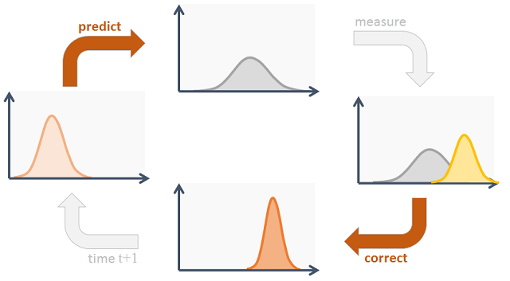
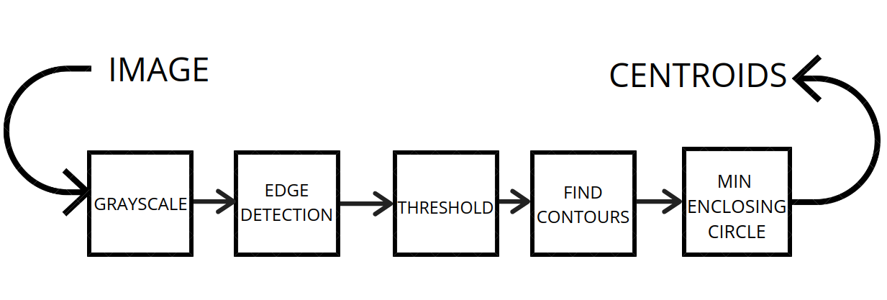
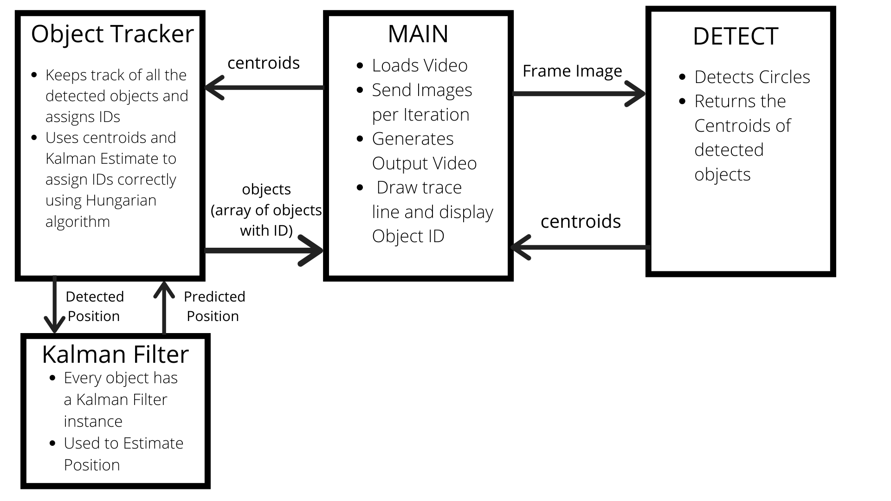

# Object Tracking using Kalman Filters 

 

                          Aman Singh  

#  Kalman Filter

Kalman filter is an algorithm that produces estimates of an unknown variable by using a series of data taken over time along with statistical noise and inaccuracies.Kalman filter uses joint probablilty distribution over the variables for each time frame.It produces better estimates than those algorithms which are based on a single measurement. 

Today kalman filters are used in guidance, navigation of vehicles such a aircraft, spacecraft and dynamically positioned ships. 
    
   

# Basics and application in 1-D

A variable whose change doesn't have an uncertainity and error can predicted precisely. Hence kalman filter is used to predict such variables which have errors in measurement and prediction.

The Kalman filter represents all distributions by Gaussian distribution.
Mean(μ) and Variance(σ2) representing a Gaussian distibution is taken as the best estimate for representing the probality distribution for the measured and estimated position of the car along the x-axis for Kalman Filter.

Kalman filters has two major iterative steps :
    
1.Predict    
    
2.Update

 

        
A 1-D Kalman Filter is used to track an object moving along the x-axis.
For example a car moving along a road with it's position being measured and estimated.
    
We assume that there is Gaussian noise ( 𝑢  ,  𝑟2 ) in measurement of the position of the car. Hence the mean and variance of the car changes as

 

 The Update step takes in the predicted postion of the car in terms of the mean ,𝜈  and variance ,𝑟2 of the Gaussian distribution representing it and updates the position based on the measured position represnted by it's mean,𝜇 and variance,𝜎2 

# Kalman Filter Equations  For 1-D model

 

 
 *  $\bf{Predict}$ $ \bf{Equations }$ : To find the current state using the previous state.
     
   * $\bf{X_t}$ : Predicted state estimate 
   * $\bf{P_k} $: Predicted error covariance 
      
  
    
* $\bf{Corrector}$ $  \bf{Equations}$ : To improve the curent estimated state by incorporating a new measurement into the model
     
    
   * $\bf{v_t}$ : Measurement residual 
    
   * $\bf{K_t}$ : Kalman gain
    
   * $\bf{X_t}$ : Updated state estimate
   
   * $\bf{P_t}$ : Updated error covariance 

    
    
  

# Predict() Equations 

 

For an object whose postion on the x-axis varies as:
    $$X(t)= t + 0.5t^2$$
The state estimate is given by
$$ X_t = A_t X_{t-1} + Bu_t $$

the error covariance matrix  is given by 
    $$P_k = E[(X^{acutal}_t -X_t)(X^{actual}_t -X_t)^T]$$
    
$$  {P}_k = A {P}_{k-1}A^T+ {Q} $$

    
 Updating $X_t$ 
    $$ X_t = X_{t-1} + \dot{X_{t-1}}\Delta t + \frac{1}{2}\dot{\dot{X_t}}{\Delta t}^2$$
    
And $\dot{X_t}$ is 
    $$\dot{X_t} = \dot{X_{t-1}} + \dot{\dot{X_{t-1}}}\Delta t $$
    
And $\dot{\dot{X_{t-1}}}$(acceleration of the car at time $t-1$) is assumed constant
    
    
The state vector
    $$\bf{X_t}=\begin{bmatrix} X_t \\ \dot{X_t}\end{bmatrix}= \begin{bmatrix} X_{t-1} + \dot{X_{t-1}}\Delta t + \frac{1}{2}\dot{\dot{X_t}}{\Delta t}^2 \\ \dot{X_{t-1}} + \dot{\dot{X_{t-1}}}\Delta t \end{bmatrix} $$

On Simplifying

$$\bf{X_t}=\begin{bmatrix} X_t \\ \dot{X_t}\end{bmatrix}= \begin{bmatrix} 1 & \Delta t \\ 0 & 1 \end{bmatrix} \begin{bmatrix} X_{t-1} \\ \dot{X_{t-1}}\end{bmatrix} + \begin{bmatrix}\frac{1}{2}{\Delta t}^2  \\ \Delta t\end{bmatrix} \dot{\dot{X_{t-1}}}$$

Comparing the above equation with kalman equations and matching the coefficents

$$A =\begin{bmatrix} 1 & \Delta t \\ 0 & 1 \end{bmatrix} $$
$$B = \begin{bmatrix}\frac{1}{2}{\Delta t}^2  \\ \Delta t\end{bmatrix}$$

Here acceleration can be thought of as the control input and B is the matrix that maps it to position and velocity. 

# Update () Equations

 

    
$$Y_t = H_tX_t + \nu_t$$    
    
$$->\nu_t = Y_t-H_tX_t........ (a)$$
    
The Updated state estimate is 
    
$$ X_t = X_t + K_t\nu_t$$ 

Substituting the equation $(a)$ 
    
$$ X_t = X_t + K_t(Y_t-H_tX_t)$$

$K_t$ is the $\bf{Kalman}$ $\bf{ Gain}$. 
    

$K_t$ is given by
    
$${K}_t = \frac{{P}_tH^T}{H{P}_tH^T+ {R} }$$
    
 $R$ is the measurement covariance matrix.
    
The updated error covariance matrix is 
    
$$ P_t = (I - K_tH_t)P_t $$
    
In case of a car we can only measure its position hence $Y_t$ is   
    
$$Y_t = X_t + \nu_t$$
    
$$  Y_t = \begin{bmatrix} 1 & 0 \end{bmatrix}\begin{bmatrix} X_t \\ \dot{X_t} \end{bmatrix} + \nu_t$$
    
$$->Y_t = \begin{bmatrix} 1 & 0 \end{bmatrix}\bf{X_t} + \nu_t$$
    
Comparing the coefficients with the kalman equation 
    
$$Y_t = \begin{bmatrix} 1 & 0 \end{bmatrix}\bf{X_t} + \nu_t$$
    
$$Y_t = H_tX_t + \nu_t$$
    
$$->H = \begin{bmatrix} 1 & 0 \end{bmatrix}$$
 

## Process noise covariance Q and Measurement noise covariance  R

 

    
If $\sigma_x$ and $\sigma_{\dot{x}}$ are the standard deviations of the position and the velocity then the  Process Noise Covariance Q is 
    
$$Q=\begin{bmatrix} {\sigma_x}^2 & \sigma_x\sigma_{\dot{x}}\\ \sigma_x\sigma_{\dot{x}} & \sigma_{\dot{x}}^2\end{bmatrix}$$

If $\sigma_{\dot{\dot{x}}}$ is the standard deviation of acceleration we can write
$$ \sigma_x = \frac{\Delta t^2}{2} \sigma_{\dot{\dot{x}}}$$
$$ \sigma_{\dot{x}} = \Delta t \sigma_{\dot{\dot{x}}}$$
    
Thus 
$$ Q=\begin{bmatrix} \frac{\Delta t^4}{4} & \frac{\Delta t^3}{2}\\ \frac{\Delta t^3}{2} & \Delta t^2\end{bmatrix} \sigma_{\dot{\dot{x}}}^2
$$ 

And R is just a scalar as we measure only one variable ,that is position.
   
 
$$R = \sigma_m^2$$
    
Q and R update the error covariance matrix $P_t$

# Object detection in 2-D

 

Blob detection is used to encirlce the object in the video which is used to test the 2D filter.
Blob detection converts the video into grayscale, detects the edjes and sets a threshold to find contours. Then the min radius cirlce is calculate which encircles the contour and it provides a centroid.

Here we use a video of a ball bouncing off the screen to test our kalman filter and blob detection.
    

# Kalman Filter Equations for 2-D model
 
 

The only major change in 2-D motion from 1-D is variable for state vector.
All the Kalman equations remain the same and apply in both X and Y direction.
Considering $X$ and $Y$ to be the concerned variables denoting the position the state vector should look like
    
$$\bf{X_t}=\begin{bmatrix} X_t \\ Y_t \\\dot{X_t}\\ \dot{Y_t}\end{bmatrix}$$
    
Subsituting the Kalman 1-D equations
    
$$\bf{X_t}=\begin{bmatrix} X_t \\ Y_t \\\dot{X_t}\\ \dot{Y_t}\end{bmatrix}= \begin{bmatrix} X_{t-1} + \dot{X_{t-1}}\Delta t + \frac{1}{2}\dot{\dot{X_t}}{\Delta t}^2 \\  Y_{t-1} + \dot{Y_{t-1}}\Delta t + \frac{1}{2}\dot{\dot{Y_t}}{\Delta t}^2 \\ \dot{X_{t-1}} + \dot{\dot{X_{t-1}}}\Delta t \\ \dot{Y_{t-1}} + \dot{\dot{Y_{t-1}}}\Delta t \end{bmatrix} $$

On simplifying

$$\bf{X_t}=\begin{bmatrix} X_t \\ Y_t \\\dot{X_t}\\ \dot{Y_t}\end{bmatrix}= \begin{bmatrix} 1 & 0 &\Delta t & 0\\ 0 & 1 & 0 &\Delta t \\ 0 &0 &1 &0 \\ 0 & 0  & 0 & 1\end{bmatrix} \begin{bmatrix} X_{t-1} \\ Y_{t-1}\\\dot{X_{t-1}}\\\dot{Y_{t-1}}\end{bmatrix} + \begin{bmatrix}\frac{1}{2}{\Delta t}^2 & 0 \\0 & \frac{1}{2}{\Delta t}^2 \\ \Delta t & 0 \\0 & \Delta t \end{bmatrix} \begin{bmatrix}\dot{\dot{X_{t-1}}}\\\dot{\dot{Y_{t-1}}}\end{bmatrix} $$

On comparing the Coefficients from the Kalman equation of state we get:
    
$$ A =\begin{bmatrix} 1 & 0 &\Delta t & 0\\ 0 & 1 & 0 &\Delta t \\ 0 &0 &1 &0 \\ 0 & 0  & 0 & 1\end{bmatrix} ;B=\begin{bmatrix}\frac{1}{2}{\Delta t}^2 & 0 \\0 & \frac{1}{2}{\Delta t}^2 \\ \Delta t & 0 \\0 & \Delta t \end{bmatrix} $$ 
    
Since only measurement available is position $H$ is 
    
$$H = \begin{bmatrix} 1 & 0 & 0 & 0 \\ 0 & 1 &0& 0 \end{bmatrix} $$

    
Process Noise covariance Q and Measurement noise covariance R  
    
$$Q=\begin{bmatrix} {\sigma_x}^2 & 0 &\sigma_x\sigma_{\dot{x}}& 0\\0& {\sigma_y}^2 & 0 &\sigma_y\sigma_{\dot{y}}\\\sigma_x\sigma_{\dot{x}} &  0 &\sigma_{\dot{x}}^2 & 0\\ 0&\sigma_y\sigma_{\dot{y}} &  0 &\sigma_{\dot{y}}^2 \end{bmatrix}$$
    

$$ \sigma_x = \frac{\Delta t^2}{2} \sigma_{\dot{\dot{x}}}$$
$$ \sigma_{\dot{x}} = \Delta t \sigma_{\dot{\dot{x}}}$$
    
Thus 
$$ Q=\begin{bmatrix} \frac{\Delta t^4}{4} & 0 &\frac{\Delta t^3}{2}& 0\\ 0 & \frac{\Delta t^4}{4} & 0 &\frac{\Delta t^3}{2}\\\frac{\Delta t^3}{2} &0  &\Delta t^2 & 0 \\ 0& \frac{\Delta t^3}{2} &0  &\Delta t^2 \end{bmatrix} \sigma_{\dot{\dot{x}}}^2
$$
    
The measurement noise R in 2-D becomes

$$R = \begin{bmatrix}\sigma_x^2 & 0 \\ 0 &\sigma_y^2\end{bmatrix}$$
    
Q and R are update the error covariance matrix $P_t$

#  Multiple Object tracking 

 

    
Multiple Object tracking allows the model to track and predict the position for multiple objects. So in order to differentiate between any two objects in the same frame we need to assign them an ID once it is detected.
    
Then the object is detected again in the next frame. We find the object with the same Id in the next frame by using the minimum weight matching which uses euclidian distance between two coordinate as weight.

The below diagram gives an idea about the same.  

    
## State Update
 

The state of the system evolves with time as
    
$$ X_t = A_t X_{t-1} + Bu_t + w_t$$
    
Where , 
   * $\bf{X_t}$ : State Vector  
    
   * $\bf{A_t} $: The State Transition Matrix.  
    
   * $\bf{u_t}$ : The Vector with control inputs. 
   * $\bf{B_t}$ : The Control Input matrix that maps the control input to the coresponding State Vector  represntation.
   * $\bf{w_t}$ :  Noise with a covariance Q. 

## System Measurement

$$ Y_t = H_tX_t + \nu_t$$
    
Where , 
   * $\bf{Y_t}$ : Vector of measurements  
    
   * $\bf{H_t} $: Matrix that maps $X_t$ to measurement space           
    
   * $\bf{\nu_t}$ :  Measurement Noise $(0, R)$  
    
Note : $\textbf{w}_k and \textbf{v}_k$ represent the process noise vector with the covariance Q and the measurement noise vector with the covariance R, respectively. They are assumed statistically independent Gaussian noise with the normal probability distribution.
    $$p(w) = N(0,Q)$$
    $$p(\nu)=N(0,R)$$
    

# The Hungarian Algorithm 

The Hungarian Algorithm helps to associate one object from one frame to another based on a score. The score used here is Convolution Cost.

 

The bipartite graph can be represnted as an adjacency matrix as shown
    
$$ Adjacency =\begin{bmatrix} dist_{11}  & dist_{12} & dist_{13} & .... & dist_{1M} \\ 
dist_{21}  & dist_{22} & dist_{23} & .... & dist_{2M}
\\.  & . & . & ..... & .
\\.  & . & . & ..... & .
\\.  & . & . & ..... & .
\\ dist_{N1}  & dist_{N2} & dist_{N3} & .... & dist_{NM}\end{bmatrix}
$$

Now the Hungarian Algorithm helps us arrive at the final optimal assignment using a few steps that involve row and column reduction on the adjacency matrix. 
    
The Hungarian Algorithm can be captured in the following steps: 
     
   * $\bf{1}$ : Find the smallest element in each row and subtract every elemnt in that row with that element.
     
   * $\bf{2}$ : Draw lines so that all the zeros are covered with minimal number of lines 
     
   * $\bf{3} $: If number of line is N then algorithm is done and all we need to do is generate assignments based on the zero elements.
     
   * $\bf{4}$ :Find the smallest entry not covered by any line. Now subtract this from every uncovered algorithm and add it to the  elements that have the horizontal and vertical lines cross each other. Now try from step 3 again.  
  
    

## Multiple Object tracking

   
 
 
 The steps in the process are in the image below.

 
    The Detector and ObjectTracker are called here to detect objects in the video input. The code can be understood using this diagram.For the object detection this kalman filter used pretrained weights based on DNN using opencv.
     
    Using a real video of road as input the kalman filter tracks the multiple ojects in the video.
 
